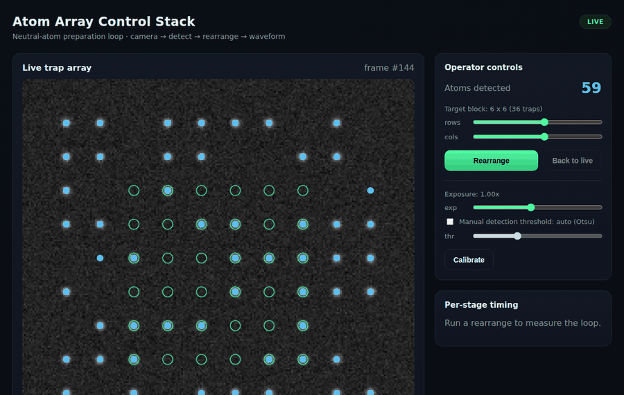
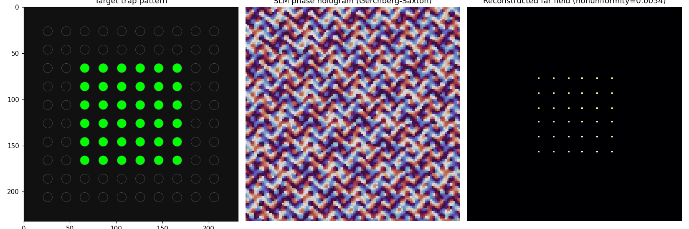
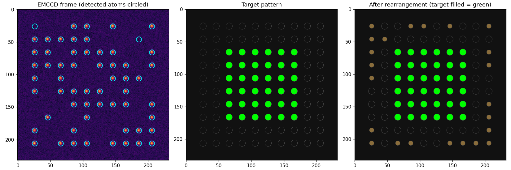

# Atom Array Control Stack

A vertical control-software stack for the preparation phase of a neutral-atom quantum computer,
built device-to-GUI: camera frame -> atom detection -> rearrangement decision -> waveform
synthesis -> actuate -> verify -> GUI.

No lab hardware was available, so the hardware is simulated -- but every software layer (Linux
device I/O, C++ middleware, algorithms, API, GUI) is real, tested, and structured as it would be
against actual EMCCD / SLM / AWG hardware.

## Why this exists

This kind of role expects one engineer to own a feature end to end -- from the hardware signal up
to the operator's screen -- without handing it off across team boundaries. This project is a
self-directed demonstration of that vertical ownership: built and tested, not just described.

## What it does

- **Device layer (C):** a simulated EMCCD camera exposed through real Linux device semantics --
  `mmap` zero-copy frame buffer, `poll`/`eventfd` frame-ready events, `ioctl`-style control.
- **Middleware (C++20):** vendor-abstract device interfaces, an explicit
  `Sequence`/`Subsystem`/`ConnectionMap`/`HardwareSetting` structure, a from-scratch Hungarian
  assignment solver, and producer-consumer threading -- the native compute loop runs in well under
  a millisecond.
- **Algorithms (Python):** atom detection, collision-free rearrangement planning, AWG waveform
  synthesis, and SLM hologram generation (weighted Gerchberg-Saxton).
- **API + GUI:** a FastAPI calibration service (REST + WebSocket) and a React/TypeScript operator
  dashboard -- live trap view with ROI selection, exposure/threshold controls, a Calibrate
  workflow, and per-stage timing.
- **Hard real-time:** a small Verilog trigger sequencer, verified in simulation to fire with zero
  cycle-to-cycle jitter -- the software timing ceiling this stack measures is real, and the
  architecture accounts for it rather than ignoring it.

Full architecture, design decisions, and what was deliberately left out of scope (and why):
[docs/architecture.md](docs/architecture.md).

## Sample output

## About this repository

This is a summary repository -- the full source (built, tested, with CI) is available on request
or live during an interview.

## Author

Built by **Sudarshan Jadhav**. Licensed under the [MIT License](LICENSE).
