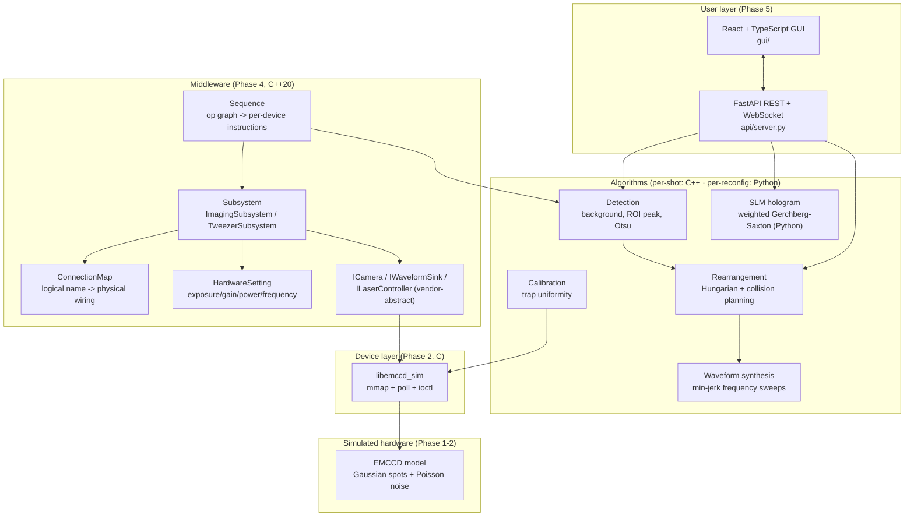
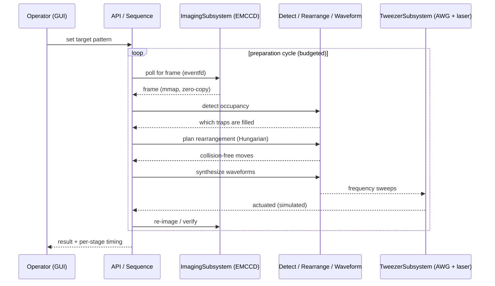

# Architecture — Atom Array Control Stack

A vertical control stack for a neutral-atom quantum computer's **preparation phase**:
image the trap array, detect atoms, decide a rearrangement, synthesize actuation,
and expose it all to an operator — under a millisecond-scale timing budget. Hardware
is simulated; every software layer is real and structured as it would be against
actual EMCCD / AWG / SLM hardware.

## Layered view



SLM hologram generation is deliberately **not** ported into the C++ hot path: it runs once per
target-pattern reconfiguration, not once per shot, so it is off the millisecond timing budget and
Python is the right tool for it (see Design decisions below).

## Control loop (sequence)



## Middleware structure: Sequence / Subsystem / ConnectionMap / HardwareSetting

These four concepts (named directly from the target role's job description) are each a distinct
file in `src/middleware/`, not just a naming exercise:

- **`Sequence`** (`sequence.hpp`) compiles a declarative, time-ordered list of steps
  (`preparation_steps()` -- acquire, detect, plan, waveform, actuate) into calls against the
  subsystems below, timing each one. Changing the step order or adding a step is a data change to
  that list, not a rewrite of the dispatch loop.
- **`Subsystem`** (`subsystem.hpp`) groups devices by function rather than exposing raw handles:
  `ImagingSubsystem` owns the camera and its trigger wiring; `TweezerSubsystem` owns the AWG
  (`IWaveformSink`) and the laser controller (`ILaserController`) together, since both actuate the
  tweezer array.
- **`ConnectionMap`** (`connection_map.hpp`) resolves logical channel names (`"x_aod"`,
  `"camera_trigger"`) to physical wiring (`"AWG_CH0"`, `"DIO3"`). If the lab gets rewired, this
  map's data changes; `Subsystem`/`Sequence` code does not.
- **`HardwareSetting`** (`hardware_setting.hpp`) is the per-device configuration/calibration data
  (exposure, gain, laser power/frequency) applied when a subsystem is constructed -- kept as plain
  data so recalibration is not a rebuild.

## Timing budget

The atom trap lifetime is the hard constraint: detection, decision, and actuation
must complete before atoms are lost. Measured stage latencies:

| Stage                  | Python (Phase 3) | C++ (Phase 4)     |
| ---------------------- | ---------------- | ----------------- |
| detect                 | ~4 ms            | ~0.46 ms          |
| plan (Hungarian)       | ~5 ms            | ~0.065 ms         |
| waveform               | ~2 ms            | ~0.17 ms          |
| **compute loop** | **~11 ms** | **~0.7 ms** |

Phase 1 quantifies the OS-level jitter that sits underneath these numbers
(`SCHED_FIFO` + `mlockall` dropped best-case wake-up latency from ~87 µs to ~13 µs).

## Target full-system architecture

The full shape this stack is built toward (some layers implemented and simulated here, some
left as documented, out-of-scope concepts -- see `docs/PLAN.md` §8):

```
GUI (React/TS) -- live image, site overlay, occupancy heatmap, sequence editor, calibration
   | WebSocket (live) + REST
Calibration API (Python) -- physicist-facing: run_sequence(), calibrate(), scan_parameter()
   | pybind11
MIDDLEWARE (C++) -- Sequence / Subsystem / ConnectionMap / HardwareSetting  [implemented]
   |
ALGORITHMS -- detection/rearrangement/waveform (C++, per-shot) · SLM hologram (Python, per-reconfig)
   |
DEVICE LAYER (C++) -- ICamera / ISLM / IAWG / ILaserController, vendor SDK wrappers + simulators
   |         |          |            |
EMCCD sim  SLM sim   AWG sim   Laser/vacuum sim     FPGA sequencer (hard real-time)
```

Two deliberate judgment calls in this design, not oversights:

- **SLM hologram generation stays in Python**, not ported to C++. It runs once per target-pattern
  reconfiguration, not once per shot, so it is off the millisecond timing budget -- using C++
  everywhere "for consistency" would be over-engineering; the right language follows the actual
  latency requirement.
- **An FPGA sequencer sits under the device layer** for hard real-time triggering. This is exactly
  why software cannot honestly claim sub-microsecond timing (`docs/timing-results.md`) -- that
  responsibility belongs to dedicated hardware, not the C++ orchestration layer. Its trigger-timing
  role is demonstrated as a small Verilog module (`src/fpga/trigger_sequencer.v`), verified with a
  Verilator testbench (`scripts/run_fpga_sim.sh`, no physical board): a camera trigger every
  `PERIOD_CYCLES` and an AWG trigger a fixed delay after it, with zero cycle-to-cycle jitter --
  the deterministic guarantee a general-purpose CPU's software loop cannot give.

## Design decisions

- **Simulated hardware, real software.** No lab hardware was available, so the
  camera/AWG/SLM/laser are modeled in software. The device layer still uses genuine
  `mmap`/`poll`/`eventfd` and an `ioctl`-style control interface, so the code maps
  directly onto a real driver.
- **Two implementations of the per-shot loop.** Python (Phase 3) is the readable
  reference and the API backend; C++ (Phase 4) is the fast native loop. This
  mirrors real labs: prototype in Python, harden the hot path in C++. SLM hologram
  generation is the one algorithm kept Python-only, deliberately (see above).
- **Vendor abstraction.** The middleware depends only on `ICamera` / `IWaveformSink`
  / `ILaserController`, so a real camera, AWG, or laser controller driver drops in
  without touching `Sequence` or `Subsystem`.
- **Timing everywhere.** Every stage is measured, because "did it fit the budget?"
  is the question that matters for this machine.

## References

The algorithms and problem framing follow the neutral-atom rearrangement
literature and classical assignment theory:

- M. Endres et al., "Atom-by-atom assembly of defect-free one-dimensional cold
  atom arrays," *Science* 354, 1024 (2016).
- D. Barredo et al., "An atom-by-atom assembler of defect-free arbitrary
  two-dimensional atomic arrays," *Science* 354, 1021 (2016).
- D. Bluvstein et al., "A quantum processor based on coherent transport of
  entangled atom arrays," *Nature* 604, 451 (2022).
- H. W. Kuhn, "The Hungarian method for the assignment problem," *Naval Research
  Logistics Quarterly* 2, 83 (1955); J. Munkres (1957).
